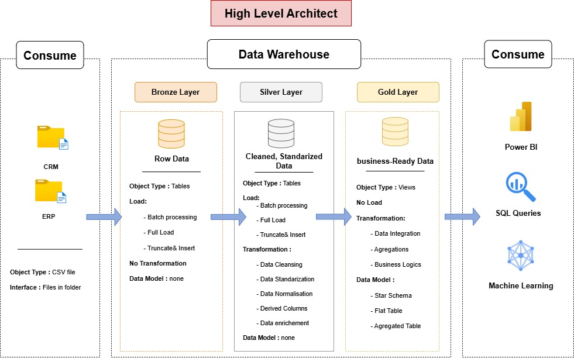

# Data Warehouse and Analytics Project

Welcome to the Data Warehouse and Analytics Project repository. This project implementation demonstrates a data warehousing and analytics solution structured around the Medallion Architecture, moving from raw data ingestion to consumption-ready analytical datasets.

---
## 🏗️ Data Architecture

The data architecture for this project follows Medallion Architecture **Bronze**, **Silver**, and **Gold** layers:

1. **Bronze Layer**: Stores raw data as-is from the source systems. Data is ingested from CSV Files into SQL Server Database.
2. **Silver Layer**: This layer includes data cleansing, standardization, and normalization processes to prepare data for analysis.
3. **Gold Layer**: Houses business-ready data modeled into a star schema required for reporting and analytics.
